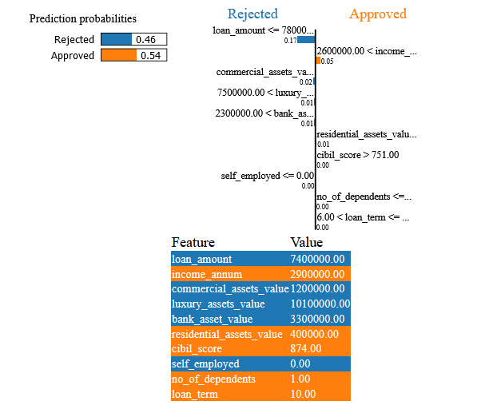

# Interactive Visualization Interface to Enhance Interpretability of AI Models for Non-Technical Stakeholders

This repository contains an interactive visualization tool that demonstrates how LIME (Local Interpretable Model-agnostic Explanations) and SHAP (SHapley Additive exPlanations) can be used to interpret complex machine learning models. The goal is to empower non-technical stakeholders—such as domain experts in finance or healthcare—to better understand model outputs and build trust in AI-driven decisions.

## Dashboard:
Try out the Dashboard for the financial dataset [here:](https://huggingface.co/spaces/AseemD/InterpretableML)


## Datasets

* **Diabetes:** Contains patient information such as glucose level, BMI, age, etc., labeled by whether the patient has diabetes or not.
* **Loan Approvals:** Includes applicant information such as credit score, loan term, and income, labeled by whether the loan was approved.


## Interpretability Methods

**Local Interpretable Model-Agnostic Explanations (LIME):**
Generates a perturbed dataset around the instance to be explained, fits an interpretable surrogate model, and shows feature contributions for that instance.


**SHapley Additive exPlanations (SHAP):**
Based on game theory, computes Shapley values representing each feature’s contribution to the model prediction.


## Respository Structure:


```

.
├── images/
│   ├── ...                           # Images for the project
│
├── datasets/
│   ├── healthcare_dataset.csv        # CSV file containing healthcare data for modeling
│   └── loan_approval_dataset.csv     # CSV file containing financial/loan data for modeling
│
├── models/
│   ├── healthcare_models.pkl         # Serialized model(s) trained on the healthcare dataset
│   └── loan_models.pkl               # Serialized model(s) trained on the loan-approval dataset
│
├── app.py                            # Main Streamlit application script for interactive model interpretation
├── Healthcare_Notebook.ipynb         # Jupyter notebook for data exploration and model training on healthcare data
├── LoanApproval_Notebook.ipynb       # Jupyter notebook for data exploration and model training on loan-approval data
├── lime_explanation.html             # HTML export of a sample LIME explanation visualization
└── README.md                         # Project overview, instructions, and documentation

```